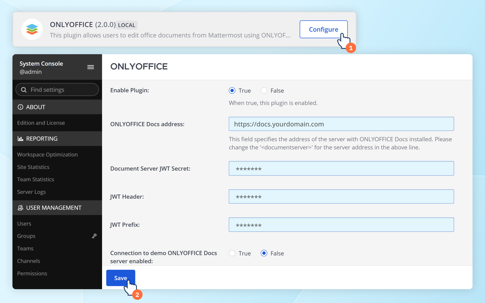
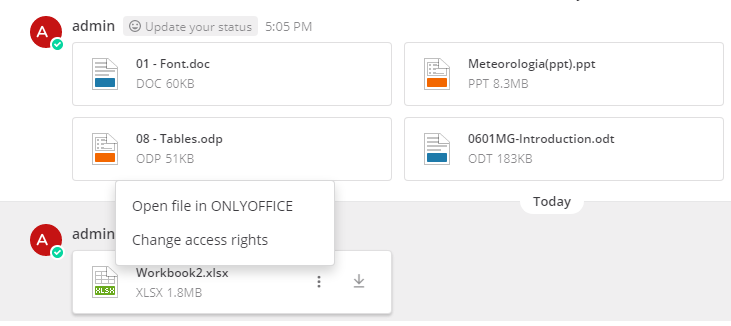
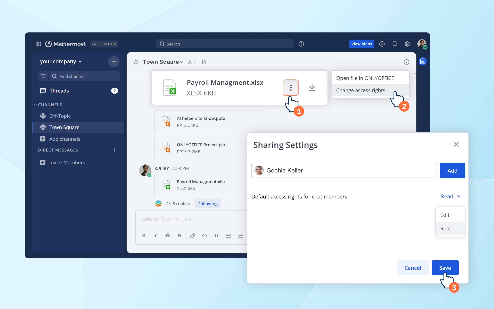
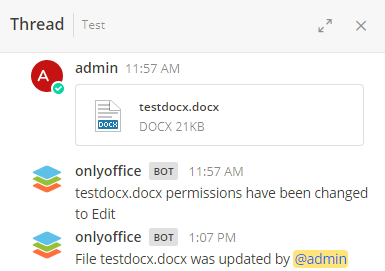

# Mattermost ONLYOFFICE integration plugin
This app enables users to edit office documents from [Mattermost](https://mattermost.com/) using ONLYOFFICE Docs packaged as Document Server - [Community or Enterprise Edition](#onlyoffice-docs-editions).

## Features

The app allows to:

* Edit text documents, spreadsheets, and presentations.
* Share files with basic permission types - viewing/editing.
* Co-edit documents in real-time.

Supported formats:

* For editing: DOCX, XLSX, PPTX.
* For viewing: XLS, XLSX, CSV, XLSM, XLT, XLTM, ODS, FODS, OTS, PPS, PPSX, PPSM, PPT, PPTX, PPTM, POT, POTX, POTM, ODP, FODP, OTP, DOC, DOCX, DOCM, DOT, DOTX, DOTM, ODT, FODT, OTT, RTF.

## Installing ONLYOFFICE Docs

You will need an instance of ONLYOFFICE Docs (Document Server) that is resolvable and connectable both from Mattermost and any end clients. ONLYOFFICE Document Server must also be able to POST to Mattermost directly.

Document Server and Mattermost can be installed either on different computers or on the same machine. In case you choose the latter option, you need to set up a custom port for Document Server. 

You can install free Community version of ONLYOFFICE Docs or scalable Enterprise Edition with pro features.

To install free Community version, use [Docker](https://github.com/onlyoffice/Docker-DocumentServer) (recommended) or follow [these instructions](https://helpcenter.onlyoffice.com/installation/docs-community-install-ubuntu.aspx) for Debian, Ubuntu, or derivatives.

To install Enterprise Edition, follow the instructions [here](https://helpcenter.onlyoffice.com/installation/docs-enterprise-index.aspx).

Community Edition vs Enterprise Edition comparison can be found [here](#onlyoffice-docs-editions).

## Installing Mattermost ONLYOFFICE integration plugin

1. Clone the [master branch](https://github.com/ONLYOFFICE/onlyoffice-mattermost).
2. Go to the project root.
3. Run: 

    ```sh
    make dist
    ```
4. Go to `<your_mattermost_host>/admin_console/plugins/plugin_management`.
5. Choose the compiled plugin from your dist folder and press Upload.

## Plugin settings



- **Document Editing Service address**:
  The URL and port of the installed ONLYOFFICE Document Server.

- **Secret key**:
  Enables JWT to protect your documents from unauthorized access (further information can be found [here](https://api.onlyoffice.com/editors/signature/)).

- **JWT Header**:
  If JWT protection is enabled, it is necessary to specify a custom header name since the Mattermost security policy blocks external 'Authorization' Headers. This header should be specified in the ONLYOFFICE Docs signature settings as well (further information can be found [here](https://api.onlyoffice.com/editors/signature/)).

- **JWT Prefix**:
  Used to specify the ONLYOFFICE Docs prefix.

## Using Mattermost ONLYOFFICE integration plugin

Users are able to open files sent in personal and group Mattermost chats for viewing and co-editing.

When files are sent in the chat message, the following actions are available in the file context menu by clicking the ⋮ symbol: 

- **Open file in ONLYOFFICE** and **Change access rights** — for the author of the message. 
- **Open file in ONLYOFFICE** — for the recipient of the message.



When clicking on the _Open file in ONLYOFFICE_ button, the corresponding ONLYOFFICE editor opens in the same window.


The author of the message with attached documents is able to change access rights to the file via the context menu using the **Change access rights** option. This action is available both in personal and group chats.



ONLYOFFICE bot sends notifications about changes in the document specifying the name of the user who made those changes.



## ONLYOFFICE Docs editions

ONLYOFFICE offers different versions of its online document editors that can be deployed on your own servers. 

**ONLYOFFICE Docs** packaged as Document Server:

* Community Edition (`onlyoffice-documentserver` package)
* Enterprise Edition (`onlyoffice-documentserver-ee` package)

The table below will help you make the right choice.

| Pricing and licensing | Community Edition | Enterprise Edition |
| ------------- | ------------- | ------------- |
| | [Get it now](https://www.onlyoffice.com/download-docs.aspx#docs-community)  | [Start Free Trial](https://www.onlyoffice.com/download-docs.aspx#docs-enterprise)  |
| Cost  | FREE  | [Go to the pricing page](https://www.onlyoffice.com/docs-enterprise-prices.aspx)  |
| Simultaneous connections | up to 20 maximum  | As in chosen pricing plan |
| Number of users | up to 20 recommended | As in chosen pricing plan |
| License | GNU AGPL v.3 | Proprietary |
| **Support** | **Community Edition** | **Enterprise Edition** |
| Documentation | [Help Center](https://helpcenter.onlyoffice.com/installation/docs-community-index.aspx) | [Help Center](https://helpcenter.onlyoffice.com/installation/docs-enterprise-index.aspx) |
| Standard support | [GitHub](https://github.com/ONLYOFFICE/DocumentServer/issues) or paid | One year support included |
| Premium support | [Buy Now](https://www.onlyoffice.com/support.aspx) | [Buy Now](https://www.onlyoffice.com/support.aspx) |
| **Services** | **Community Edition** | **Enterprise Edition** |
| Conversion Service                | + | + |
| Document Builder Service          | + | + |
| **Interface** | **Community Edition** | **Enterprise Edition** |
| Tabbed interface                       | + | + |
| Dark theme                             | + | + |
| 150% scaling                           | + | + |
| White Label                            | - | - |
| Integrated test example (node.js)     | + | + |
| Mobile web editors | - | + |
| Access to pro features via desktop     | - | + |
| **Plugins & Macros** | **Community Edition** | **Enterprise Edition** |
| Plugins                           | + | + |
| Macros                            | + | + |
| **Collaborative capabilities** | **Community Edition** | **Enterprise Edition** |
| Two co-editing modes              | + | + |
| Comments                          | + | + |
| Built-in chat                     | + | + |
| Review and tracking changes       | + | + |
| Display modes of tracking changes | + | + |
| Version history                   | + | + |
| **Document Editor features** | **Community Edition** | **Enterprise Edition** |
| Font and paragraph formatting   | + | + |
| Object insertion                | + | + |
| Adding Content control          | - | + | 
| Editing Content control         | + | + | 
| Layout tools                    | + | + |
| Table of contents               | + | + |
| Navigation panel                | + | + |
| Mail Merge                      | + | + |
| Comparing Documents             | - | + |
| **Spreadsheet Editor features** | **Community Edition** | **Enterprise Edition** |
| Font and paragraph formatting   | + | + |
| Object insertion                | + | + |
| Functions, formulas, equations  | + | + |
| Table templates                 | + | + |
| Pivot tables                    | + | + |
| Data validation                 | + | + |
| Conditional formatting | + | + |
| Sheet Views                     | - | + |
| **Presentation Editor features** | **Community Edition** | **Enterprise Edition** |
| Font and paragraph formatting   | + | + |
| Object insertion                | + | + |
| Transitions                     | + | + |
| Presenter mode                  | + | + |
| Notes                           | + | + |
| | [Get it now](https://www.onlyoffice.com/download-docs.aspx#docs-community)  | [Start Free Trial](https://www.onlyoffice.com/download-docs.aspx#docs-enterprise)  |

In case of technical problems, the best way to get help is to submit your issues [here](https://github.com/ONLYOFFICE/onlyoffice-mattermost/issues). Alternatively, you can contact ONLYOFFICE team on [forum.onlyoffice.com](https://forum.onlyoffice.com/).
